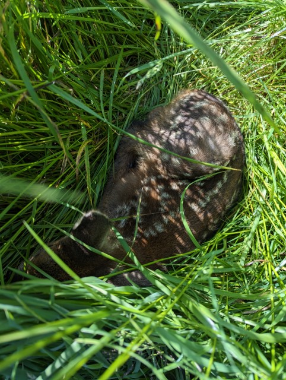
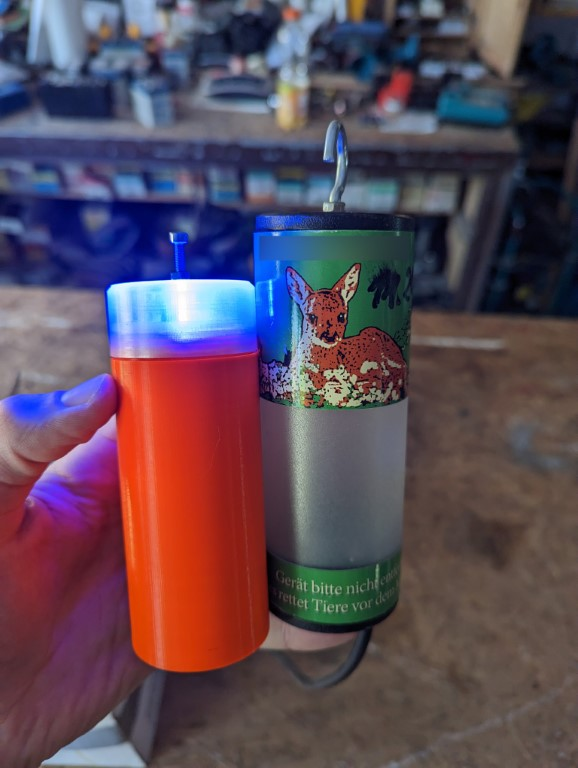

# Oh Deer!

A non-profit and open source project, with the goal to develop a device to frighten deer and other ferral animals.

## About this project

Every spring, usually around May, deer will give birth to their fawns. Still not being able to run away from potential predators, those fawns will rely on their camouflage and remarkable abscence of any kind of scent to survive. Early in the morning, still before sunrise, their mothers will lay them down in high grass, where they hopefully won't be discovered, to pick them up again at dawn.

Unfortunately, this time of the year does overlap with farmers having to mow their meadows. As you might guess, the tractor does not really care about good camouflage at all - so when the fawns will instinctively just put their head down, being mowed over will result in certain death.

Of course, farmers are obligers to take precautions, but if only half of all farmers would actually take what is required, the [...]
At least in Germany, hunters will support the farmers to prevent fawns from death by mower, sometimes by taking multiple precautions. Hunters will walk through the meadows in tight grids, fly over them using drones and thermal imaging technology and (that's what this project is about) take measures so the deer won't put their fawns in the grass in the first place.

Taking a commercial product as an example, we developed a device, that is placed in the meadows the day befor the farmer want's to mow it. The loud beeping and random, bright, blue blinking of the device will (hopefully) scare mother deer so much, that they won't put their fawns in this field specifically.

The reference product that we used for the past years did cover our needs, but was way to expensive for the ammount we required. For larger meadows, you'll need around 10-15 of those tubes, costing a hefty four-digit ammount of money that we have to largely pay out of our own pockets. 

This is why we started to develop our own, low-cost variant of this. Apart from you having to assemble it manually, we do have many advantages over the commercial one:

- Being open source means you can modify it to fit your specific needs
- We come in at less than a tenth of the price of the commercial one
- The conveniance in handeling of Oh Deer is far higher, mostly because of the integrated battery/charger
- The LED is way brighter and does have a seemingly random pattern
- In our next iteration, the buzzer will be much louder, covering a higher radius

In case you want to build your own devices from this, you should find everything required within this repository.

## First / Second iteration

As a first draft, I developed the project around the STM8F103 microcontroller. Back in the day, it way readily available and cheap. 
The second iteration will be using a Risc V controller from CHT (CH32V003), which has become famous for being one of the cheapest general-purpose µCs there is.

## Getting started

To actually build the devices on your own / contribute to the project, please follow the guides for each HW iteration:

- [1. Iteration](doc/1.0_Getting_Started.md)
- [1. Iteration](doc/2.0_Getting_Started.md)