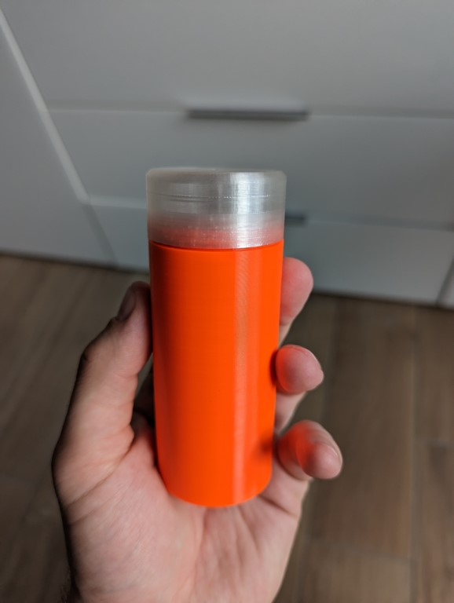

# Getting Started - First iteration

## Hardware requirements

- [PCB](https://oshwlab.com/tillmann95/oh-deer)
- [ST-Link V2](https://www.st.com/en/development-tools/st-link-v2.html) (or Mini) + 4 Socket-to-Socket Jumper cables
- [3D printed Case](../cad/ReadMe.md)
- 1 - 2 Generic 18650 (Li-Ion) cells
- _(optional)_ A spot welder & some nickle strips
- [Battery Protection module](https://www.reichelt.de/entwicklerboards-ladeplatine-fuer-3-7v-li-akkus-usb-c-1a-debo1-3-7li-1-0a-p291398.html)
- Piezo buzzer
- Some generic M3 screws for assembly

## Software requirements

- Visual Studio Code
- PlatformIO plugin for VS Code
- ST-Link drivers

## PCB Assembly

- Do detailed assembly guide yet
- Figure this out on your own using the [PCB drawing](../pcb/PCB_PCB_oh%20deer_2023-03-23.pdf) and [circuit schematic](../pcb/Schematic_oh%20deer_2023-03-23.pdf)

## Preparing the flashing/debugging

Connect the following pins from the ST-Link V2 to the PCB. You should find their labels on the device/PCB:

- GND
- SWIM
- RST
- 3V3 (or 5V, both will work)

By using 3V3, the buzzer is somewhat easier to bear during development. Even taping it shut will only dampen the noise so a somewhat bearable level.

## Compiling & FW download

After opening this project in PlatformIO, you can just hit the "Upload" button from inside PlatformIO. Now the device should already be blinking & beeping.

## Mounting the buzzer

The buzzer gets screwed in using M3  screws (5mm - 8mm length).

This can be a bit fiddly. If you bend the wires straight before inserting, you might have an easier time.

## _(optional)_ Battery pack assembly

The _proper_ way to connect 18650 cells to a pack and connect wires to them is using a spot welder:

This makes sure that the delicate cells don't overheat and explode. _It is possible_ to solder directly to the pads, but it's a pain in the ass and I can only **strongly** discurage you from trying this. However, I can't tell that I've never done this myself in a time of great need, but that's up to you.

Connect the cells in parallel for higher capacity. It's totally fine to use old, recycled cells. With one cell of ~2500mAh capacity left, you'll still get a battery life of about a week.

The case is designed so that the two batteries should touch each other to fit in, so keep that in mind and make sure that the cell remain perfectly parallel when welding them. 

**WARNING:** Make sure that the two leads don't short out!
The cells currently don't have short-circuit protection and might blow up if shorted. 

## Battery mounting

Connect the "raw" battery (-pack) to the charge/protection module. The modules usually have terminals labeled `B+` and `B-` for the cell connections.

Remember to connect cables to the module's output, that are still long enough to be connected to the Oh deer! PCB once the protection module is glued in place.The output wires are meant to receive a dupont connector, so you can (dis-) connect them easily. This also is used to trn the whole thing on or off.

The cells and the module itself are glued to the base case using generic contact/all purpose glue. You can use epoxy or super glue, but be aware that some of those harden in an exothermic way, which might actually overheat your cells.

## Final steps

Solder the buzzer to the main PCB. Now you can check if everything is working as intended!

Connect the protection board to the main PCB. The LED should now start flashing and the buzzer should start beeping.

If everything works as intended, you're basically done!

Disconnect the power leads from the PCB to turn it off. Once you want to use it, connect them, put the main PCB into the base case and screw on the lid.

